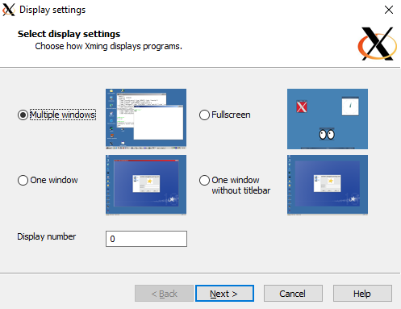
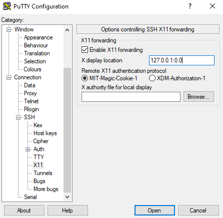
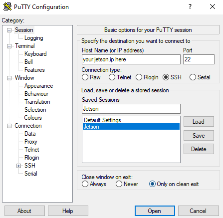

In the last post, [Networking](https://bhs-av.github.io/devlog/2019-11-04-networking/), we worked on improving the networking capabilities of the Jetson. We did this by adding a router to the car and altering the network properties so that we could access the internet and also support a LAN at the same time.

# Remote Access
One of the major problems with developing on the Jetson is easily accessing it. Before we implemented X11 forwarding we had two options to interact with the Jetson.
The first was directly connecting the Jetson to a monitor, keyboard, and mouse. However, this had the slight disadvantage of requiring us to take out the peripherals every time we wanted to test something.
Change just one line of code? Don't worry you just have to unplug everything, redo the wiring, and now you can test it. The second method was using SSH. The problem with SSH is that if we ever wanted to run a graphical application, we couldn't. While there's nothing wrong with the command line it becomes a little bit of an issue when your main way of programming is through an IDE with a GUI.

Implementing X11 made the process of connecting and interacting the Jetson far easier. Through X11 forwarding we could use that same SSH connection to remotely access the Jetson and even use graphical applications. This helped streamline the development process and made hotfixes not take 10 minutes.

# What is X?
X is a mechanism by with a Linux computer (our Jetson) can relay its applications through an SSH connection. The advantage of X is that by using a server on the client machine that will remote access (the computer that will access the Jetson) you can run graphical applications as if they were taking place on the host machine.
 
# Setting Up X11

## Setting up the Jetson
In order to enable X11 forwarding on the Jetson, you first have to change the SSH settings to allow for X-forwarding. This involves changing system files as a superuser. Then we have to change values in the Jetson's SSH files. 

To do this open up a terminal on the Jetson and use the following commands:

- sudo apt-get install xauth
> This makes sure you have X installed on your Jetson, though it should be installed by default
- `sudo su`
> This puts us in superuser and allows us to access
- cd ~/etc/.ssh
- cp config config.backup
> Make a backup in case something goes wrong.
- sudo vi config
- Find the line for X11 forwarding and make sure it is turned on. It should look something like this
```
ForwardX11 yes
ForwardX11Trusted yes
```
- Save and exit the file using `Esc` and entering `:wq`
- Reboot the Jetson

If you follow the above steps the Jetson will enable its X11 client and run it every time the Jetson starts. This will allow us to use another computer to enter the Jetson and use graphical applications.

## Setting up the Remote Access
X11 doesn't do much good for us if we don't have another computer that we want to access the Jetson remotely. Using applications called PuTTY and Xming, we are able to start an X11 server on our Windows machine and access the Jetson remotely. In order to complete this successfully, make sure you have access to your router admin panel as you'll need to grab the IP of your Jetson on the LAN.
To setup XMing and PuTTy, follow these steps:

- Download and install [PuTTY](https://www.chiark.greenend.org.uk/~sgtatham/putty/)
- Download and install [Xming](https://sourceforge.net/projects/xming/)
- Once Xming is installed, you will have a program name XLaunch installed on your computer. Running it opens a setup window like this:


- Click next, leaving the default options until you get to the end.
- Click `Finish`. You should now see an Xming server icon in your toolbar.
- Hover over the Xming server icon and make sure that it says Server:0.0. This ensures that the X server is running on your local machine.
- Now open up PuTTY.
- On the sidebar, find the menu option that says SSH. 
- Opening up the SSH menu gives you the option to edit the X11 settings.
- Check `Enable X11 Forwarding` and for the `X display location` enter 127.0.0.1:0.0


> The X display location is where the X server is running on our computer. When we checked the Xming utility in the toolbar it told us that the server was running on the localhost (our computer) at 0.0. Entering this into out display location is how we get to use X11.
- Return to the `Session` tab and enter your Jetson IP (the one you got from the router) into the `Host Name`. You can leave the other settings as default.


> Note: If you enter a name under `Saved Sessions` and click `Save`, it will save the current configuration. If you do not save the configuration you will have to configure the X11 settings and the `Host Name` each time you run PuTTY


# Conclusion
When you open the SSH session on PuTTY now, your computer will connect to the Jetson terminal. It will ask you to login with your user credentials, but after that, you have complete control over the Jetson as if you were sitting in front of it. You can run any terminal command as well as open up graphical applications.
An easy way to test the X server is to launch `sudo nautilus`. This opens the file manager for Ubuntu. You will get the graphical version of nautilus and you can snoop through all your files to make sure the connection is working
Note, however, that when you execute a graphical application it will be tied to the SSH session. This means that you can't open multiple applications at the same time from the terminal as you'll have to exit the window before opening another one. However, you can get around this by using a terminal command called 'screen'.
This functions exactly as the name implies. The program allows you to make "screens" that run in parallel and allow you to switch between them without stopping running processes. Here is a guide on how to use screen on ubuntu: [Screen](https://help.ubuntu.com/community/Screen)

With the above steps completed you now have complete remote access to your Jetson. You no longer have to plug into a monitor or remove a keyboard and mouse every time you want to test. Just remote in with another computer and everything on the Jetson is available at the push of a button.
